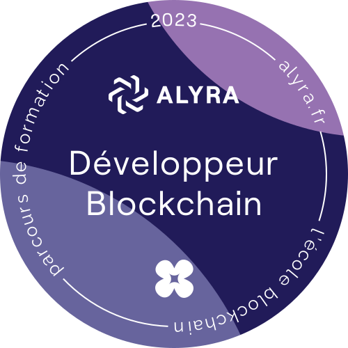

## <!-- version 2 - 202403 -->

<h1 align="center">Hello there, I'm Igor!👋</h1>
<h3 align="center" style="font-style:italic;">A full stack blockchain developer</h3>

&nbsp;

<!--
"The best way to predict the future is to invent it." - Alan Kay
"Code is like humor. When you have to explain it, it’s bad." - Cory House
"Simplicity is the ultimate sophistication." - Leonardo da Vinci
"Think twice, code once." - Waseem Latif
“Always code as if the guy who ends up maintaining your code will be a violent psychopath who knows where you live.” — John Woods
-->

---

📍 Based In: France - Thriving in the global digital landscape.

🤝 Let's Collaborate: Eager to contribute to Web3 projects or assist others to learn and progress.

🔭 Open to work: Passionate about crafting a better future through Web3, I'm seeking exciting blockchain ventures.

☕ Fueled by an insatiable curiosity and a strong desire to build, with skills for teamwork and supporting others.

📘 Currently Learning: Sharpening my skills with Foundry; also, embracing and taming the complexities of Rust.

💬 Ask me about Solidity, Foundry, Optimization.

📩 Reach Out: To discuss blockchain opportunities or collaboration, shoot me an email at craftadapp@proton.me.

🔗 Connect with me:

## 🚀 About Me

✈️ **Background:** Former aspiring airline pilot with full aviation training and instructor’s license.

🍽️ **Experience:** Spent 20 years serving in prestigious cafes and restaurants, blending passion with professionalism.

🌐 **My Blockchain Odyssey:**

- 💻 **Rain Check:** Always curious about programming, I tried a first approach with the CNAM in 2013, while working.
- 🧩 **Initial Spark:** Interest in blockchain technology ignited in 2017. Then the first lockdown was a turning point, discovering Web3 development with Ivan on Tech (now Moralis.io) and a super mentor.
- 🚀 **Taking the Leap:** Decided in 2023 to pursue my passion for coding, problem-solving, and continuous learning in the blockchain space. So I enrolled in the Alyra blockchain developer program in 2023 to build a strong foundation.
- 📚 **Current Endeavors:** Currently, I'm deepening my knowledge in blockchain technologies, participating in hackathons, online courses, and CTFs, and constantly exploring new ideas.

## 🎯 Activities and Interests

<!-- My Focus Areas  -->

### ✍️ Blog posts & contributions

Believing in the power of sharing knowledge, after initially engaging in the process through reviewing content, I was inspired to take a step further by writing articles myself, aiming to solidify my understanding and share what I've learned.

<table width="100%">
  <tr>
    <td align="left" width="50%">🇬🇧 <b><a href="https://medium.com/@franck.maussand/optimization-on-ethereum-make-a-difference-with-function-names-9cc4a963424b">Optimization on Ethereum: Make a Dif ...<i>reviewer</a></b></td>
    <td align="left" width="50%">🇬🇧 <b><a href="https://medium.com/@franck.maussand/solana-ethereum-function-visibility-41a293fe7078">Solana / Ethereum: Function Visibility <i>reviewer</a></b></td>
  </tr>
  <tr>
    <td>🇫🇷 <b><a href="https://github.com/Laugharne/pow_pos_poh/tree/main/fr">PoW, PoS, PoH : Guide des consensus <i>reviewer</i></a></b>
    </td>
    <td>
    </td>
  </tr>

</table>

### 🔄 Ethereum & EVM:

Focused on Ethereum and EVM-compatible blockchains, I am currently honing my skills with Foundry, diving deeper into security and optimization aspects of blockchain development. I believe that mastering these two foundations is essential for the adoption of this technology.

<table width="100%">
  <tr>
    <td align="left" width="50%"><b><a href="https://github.com/ibourn/1-horse-store">Exploring Huff, Yul, Solidity, and Differential Testing</a></b></td>
    <td align="left" width="50%"><b><a href="https://github.com/ibourn/foundry-defi-stablecoin">Diving into Stablecoin, Invariant, and Fuzz Testing</a></b></td>
  </tr>

  <tr>
    <td><b><a href="https://github.com/ibourn/foundry-smart-contract-lottery">Implementing a Lottery with Chainlink VRF and Automation</a></b></td>
    <td><b><a href="https://github.com/ibourn/foundry-dao">Creating a DAO Using the OpenZeppelin Solution</a></b></td>
  </tr>

  <tr>
    <td><b><a href="https://github.com/ibourn/Developpeur-Ethereum-Template">Tracking Alyra's Ethereum Developer Course</a></b>
    </td>
    <td>
    </td>
  </tr>

</table>

### 🌍 Beyond EVM:

Exploring other ecosystems like Tezos, believing in a future of interoperable multichain technologies.

<table width="100%">
  <tr>
    <td align="center"><i>coming soon...</i></td>
    <!-- <td align="center" width="50%"><i>coming soon...</i></td> -->
    <!-- <td align="left" width="50%"</td> -->
  </tr>

</table>

### 🏛️ Broad Foundations:

Convinced that any specialization must be supported by a broad knowledge base, I immerse myself in fundamental languages such as Bash, while embracing technologies of the future like Rust, which I learn to master little by little in all its complexity.

<table width="100%">
  <tr>
    <td><b><a href="https://github.com/ibourn/rust-by-practice">Practice Rust with challenging exercises...</a></b></td>
    <td><b><a href="https://github.com/ibourn/rusty_advent_of_code">Rusty advent of code</a></b></td>
  </tr>

  <tr>
    <td align="left" width="50%"><b><a href="https://github.com/ibourn/bash_script_utilities">Bash scripts to make life easier</a></b></td>
    <td align="left" width="50%"></td>
  </tr>

</table>

## 🔍 What's Next?

🕵️ Emerging Technologies: Eager to explore Zero-Knowledge Proofs (ZKP) and Account Abstraction as my next top priorities.

🐳 DevOps Skills: In the idea of broad foundation, I'm planning to deepen my knowledge in Docker.

🛡️ Security & Optimization: In the longer term, dedicating more time to learning about security and optimization on EVM.

## 🛠️ My Tech Palette

<!-- 🖥️ Technologies & Tools I Have Used and Learned
Digital Craftsmanship
My Tech Palette -->

        

    

---

        

---

  

<img src="https://img.shields.io/badge/Uniswap-gray.svg?logo=data:image/svg+xml;base64,PHN2ZyB3aWR0aD0iMjU3IiBoZWlnaHQ9IjI1NiIgdmlld0JveD0iMCAwIDI1NyAyNTYiIGZpbGw9Im5vbmUiIHhtbG5zPSJodHRwOi8vd3d3LnczLm9yZy8yMDAwL3N2ZyI+PHBhdGggZD0iTTk2LjQzNSA2MC4yNzdjLTIuMDkyLS4zMjUtMi4xOC0uMzYzLTEuMTk2LS41MTQgMS44ODYtLjI5IDYuMzQuMTA1IDkuNDA5LjgzNSA3LjE2NCAxLjcwMyAxMy42ODMgNi4wNjYgMjAuNjQyIDEzLjgxNGwxLjg0OSAyLjA1OCAyLjY0NS0uNDI1YzExLjE0Mi0xLjc5IDIyLjQ3Ni0uMzY4IDMxLjk1NyA0LjAxMiAyLjYwOCAxLjIwNSA2LjcyIDMuNjAzIDcuMjM0IDQuMjIuMTYzLjE5Ni40NjQgMS40Ni42NjcgMi44MS43MDUgNC42NjcuMzUyIDguMjQ1LTEuMDc1IDEwLjkxOC0uNzc3IDEuNDU0LS44MjEgMS45MTUtLjI5OSAzLjE1OS40MTguOTkzIDEuNTggMS43MjggMi43MzEgMS43MjcgMi4zNTYtLjAwMyA0Ljg5Mi0zLjgxMiA2LjA2Ny05LjExMWwuNDY2LTIuMTA1LjkyNSAxLjA0N2M1LjA3MSA1Ljc0NiA5LjA1NSAxMy41ODIgOS43MzkgMTkuMTU5bC4xNzggMS40NTUtLjg1Mi0xLjMyMmMtMS40NjgtMi4yNzUtMi45NDItMy44MjQtNC44MjktNS4wNzMtMy40MDMtMi4yNTEtNy0zLjAxOC0xNi41MjktMy41Mi04LjYwNS0uNDUzLTEzLjQ3NS0xLjE4OC0xOC4zMDUtMi43NjMtOC4yMTYtMi42NzktMTIuMzU4LTYuMjQ3LTIyLjExOS0xOS4wNTItNC4zMzUtNS42ODgtNy4wMTQtOC44MzUtOS42OC0xMS4zNy02LjA1Ni01Ljc1OC0xMi4wMDctOC43NzgtMTkuNjI1LTkuOTYiIGZpbGw9IiNGRjAwN0EiLz48cGF0aCBkPSJNMTcwLjkxNiA3Mi45NzZjLjIxNi0zLjgxMS43MzMtNi4zMjUgMS43NzItOC42Mi40MTEtLjkxLjc5Ny0xLjY1My44NTYtMS42NTMuMDYgMC0uMTE5LjY3LS4zOTcgMS40OS0uNzU2IDIuMjI4LS44OCA1LjI3Ni0uMzU5IDguODIxLjY2IDQuNSAxLjAzNiA1LjE0OCA1Ljc5MSAxMC4wMDggMi4yMyAyLjI4IDQuODI0IDUuMTU0IDUuNzY1IDYuMzg4bDEuNzEgMi4yNDUtMS43MS0xLjYwNGMtMi4wOTEtMS45NjItNi45LTUuNzg3LTcuOTYzLTYuMzMzLS43MTItLjM2Ny0uODE4LS4zNi0xLjI1Ny4wNzctLjQwNS40MDMtLjQ5IDEuMDA4LS41NDcgMy44Ny0uMDg3IDQuNDYyLS42OTUgNy4zMjUtMi4xNjMgMTAuMTg4LS43OTMgMS41NDktLjkxOSAxLjIxOC0uMi0uNTMuNTM2LTEuMzA1LjU5MS0xLjg3OC41ODctNi4xOTctLjAwOS04LjY3OC0xLjAzOS0xMC43NjQtNy4wOC0xNC4zMzctMS41MzEtLjkwNi00LjA1My0yLjIxMS01LjYwNC0yLjkwMi0xLjU1Mi0uNjktMi43ODQtMS4yOTItMi43MzktMS4zMzcuMTcxLS4xNyA2LjA2MyAxLjU1IDguNDM0IDIuNDYyIDMuNTI3IDEuMzU3IDQuMTEgMS41MzIgNC41MzggMS4zNjkuMjg3LS4xMS40MjYtLjk0Ni41NjYtMy40MDVNMTAwLjQ5NyA4Ny44MmMtNC4yNDYtNS44NDQtNi44NzItMTQuODA2LTYuMzA0LTIxLjUwNmwuMTc2LTIuMDczLjk2Ni4xNzdjMS44MTUuMzMgNC45NDUgMS40OTUgNi40MSAyLjM4NSA0LjAyMSAyLjQ0MiA1Ljc2MSA1LjY1NyA3LjUzMiAxMy45MTMuNTE5IDIuNDE5IDEuMiA1LjE1NSAxLjUxMyA2LjA4Mi41MDQgMS40OSAyLjQwOSA0Ljk3NCAzLjk1OCA3LjIzNiAxLjExNiAxLjYzLjM3NSAyLjQwMi0yLjA5MSAyLjE3OS0zLjc2Ny0uMzQtOC44NjktMy44NjEtMTIuMTYtOC4zOTJtNjUuMjY5IDQzLjUwMmMtMTkuODQxLTcuOTg4LTI2LjgyOS0xNC45MjMtMjYuODI5LTI2LjYyMyAwLTEuNzIxLjA1OS0zLjEzLjEzMS0zLjEzcy44NC41NjggMS43MDYgMS4yNjNjNC4wMjMgMy4yMjcgOC41MjkgNC42MDUgMjEuMDAyIDYuNDI1IDcuMzM5IDEuMDcgMTEuNDY5IDEuOTM1IDE1LjI4IDMuMTk5IDEyLjExIDQuMDE2IDE5LjYwMiAxMi4xNjcgMjEuMzg5IDIzLjI2OC41MTkgMy4yMjYuMjE1IDkuMjc1LS42MjcgMTIuNDYzLS42NjUgMi41MTgtMi42OTMgNy4wNTctMy4yMyA3LjIzMS0uMTQ5LjA0OS0uMjk2LS41MjMtLjMzNC0xLjMwMS0uMjA0LTQuMTY4LTIuMzExLTguMjI3LTUuODQ4LTExLjI2Ny00LjAyMy0zLjQ1Ni05LjQyNy02LjIwOC0yMi42NC0xMS41MjhtLTEzLjkyOSAzLjMxOWMtLjI0OS0xLjQ3OS0uNjgtMy4zNjktLjk1OC00LjE5OGwtLjUwNy0xLjUwOS45NDEgMS4wNTZjMS4zMDEgMS40NiAyLjMyOSAzLjMyOSAzLjIwMSA1LjgxOS42NjUgMS45Ljc0IDIuNDY1LjczNSA1LjU1Mi0uMDA1IDMuMDMxLS4wODggMy42NjctLjcwMyA1LjM3Ny0uOTY4IDIuNjk3LTIuMTcgNC42MDktNC4xODcgNi42NjEtMy42MjQgMy42ODktOC4yODQgNS43MzEtMTUuMDA4IDYuNTc4LTEuMTY5LjE0Ny00LjU3Ni4zOTUtNy41NzEuNTUxLTcuNTQ4LjM5My0xMi41MTYgMS4yMDQtMTYuOTc5IDIuNzcxLS42NDIuMjI1LTEuMjE1LjM2Mi0xLjI3My4zMDQtLjE4MS0uMTc5IDIuODU4LTEuOTkxIDUuMzY5LTMuMiAzLjUzOS0xLjcwNSA3LjA2My0yLjYzNiAxNC45NTctMy45NSAzLjktLjY1IDcuOTI3LTEuNDM4IDguOTUtMS43NTIgOS42NTctMi45NjEgMTQuNjIyLTEwLjYwMiAxMy4wMzMtMjAuMDYiIGZpbGw9IiNGRjAwN0EiLz48cGF0aCBkPSJNMTYwLjkzMiAxNTAuNzk1Yy0yLjYzNi01LjY2Ny0zLjI0MS0xMS4xMzgtMS43OTctMTYuMjQxLjE1NC0uNTQ1LjQwMy0uOTkyLjU1Mi0uOTkycy43NzIuMzM3IDEuMzgzLjc0OGMxLjIxNC44MTcgMy42NTEgMi4xOTUgMTAuMTQyIDUuNzM0IDguMDk5IDQuNDE2IDEyLjcxNyA3LjgzNSAxNS44NTggMTEuNzQyIDIuNzUgMy40MjIgNC40NTIgNy4zMTggNS4yNzEgMTIuMDcuNDY0IDIuNjkyLjE5MiA5LjE2OC0uNDk4IDExLjg3OS0yLjE3OCA4LjU0Ni03LjIzOSAxNS4yNTgtMTQuNDU4IDE5LjE3Ni0xLjA1OC41NzMtMi4wMDggMS4wNDQtMi4xMSAxLjA0Ny0uMTAzLjAwMi4yODItLjk3OC44NTYtMi4xNzggMi40MjktNS4wNzcgMi43MDUtMTAuMDE1Ljg2OS0xNS41MTEtMS4xMjQtMy4zNjUtMy40MTYtNy40NzItOC4wNDQtMTQuNDEyLTUuMzgxLTguMDY5LTYuNy0xMC4yMTYtOC4wMjQtMTMuMDYybS03NC41MjUgMzAuNTc2YzcuMzYzLTYuMjE3IDE2LjUyNC0xMC42MzMgMjQuODY5LTExLjk4OSAzLjU5Ni0uNTg0IDkuNTg4LS4zNTIgMTIuOTE4LjUgNS4zMzggMS4zNjYgMTAuMTEzIDQuNDI2IDEyLjU5NyA4LjA3MiAyLjQyNyAzLjU2MyAzLjQ2OCA2LjY2OCA0LjU1MiAxMy41NzYuNDI4IDIuNzI1Ljg5MyA1LjQ2MiAxLjAzNCA2LjA4MS44MTQgMy41ODEgMi4zOTggNi40NDMgNC4zNjIgNy44OCAzLjExOCAyLjI4MiA4LjQ4OCAyLjQyNCAxMy43Ny4zNjQuODk2LS4zNSAxLjY3NS0uNTkyIDEuNzI5LS41MzcuMTkyLjE5LTIuNDY4IDEuOTctNC4zNDQgMi45MDgtMi41MjUgMS4yNjEtNC41MzMgMS43NDktNy4yMDEgMS43NDktNC44MzggMC04Ljg1NC0yLjQ2MS0xMi4yMDYtNy40OC0uNjU5LS45ODctMi4xNDEtMy45NDUtMy4yOTQtNi41NzMtMy41MzgtOC4wNzEtNS4yODYtMTAuNTI5LTkuMzk0LTEzLjIyLTMuNTc2LTIuMzQxLTguMTg3LTIuNzYxLTExLjY1Ni0xLjA2LTQuNTU3IDIuMjM0LTUuODI4IDguMDU3LTIuNTY0IDExLjc0OCAxLjI5NyAxLjQ2NiAzLjcxNiAyLjczMSA1LjY5NCAyLjk3NyAzLjcuNDYxIDYuODgtMi4zNTQgNi44OC02LjA5IDAtMi40MjYtLjkzMi0zLjgxLTMuMjgtNC44Ny0zLjIwNS0xLjQ0Ni02LjY1MS4yNDUtNi42MzUgMy4yNTYuMDA3IDEuMjg0LjU2NyAyLjA5MSAxLjg1NCAyLjY3My44MjYuMzc0Ljg0NS40MDQuMTcxLjI2NC0yLjk0MS0uNjEtMy42My00LjE1Ni0xLjI2NS02LjUxIDIuODM5LTIuODI2IDguNzExLTEuNTc5IDEwLjcyNyAyLjI3OC44NDcgMS42Mi45NDUgNC44NDcuMjA3IDYuNzk2LTEuNjUzIDQuMzYxLTYuNDcyIDYuNjU1LTExLjM2MSA1LjQwNy0zLjMyOC0uODUtNC42ODQtMS43Ny04LjY5Ny01LjkwNC02Ljk3My03LjE4My05LjY4LTguNTc1LTE5LjczMy0xMC4xNDRsLTEuOTI2LS4zMDF6IiBmaWxsPSIjRkYwMDdBIi8+PHBhdGggZmlsbC1ydWxlPSJldmVub2RkIiBjbGlwLXJ1bGU9ImV2ZW5vZGQiIGQ9Ik0zMy44MjQgMjAuNDY1YzIzLjI4NyAyOC4yNjMgNTkuMTkgNzIuMjY5IDYwLjk3MiA3NC43MzMgMS40NzIgMi4wMzQuOTE4IDMuODYzLTEuNjAzIDUuMjk2LTEuNDAyLjc5Ny00LjI4NSAxLjYwNS01LjcyOCAxLjYwNS0xLjYzMiAwLTMuNDcxLS43ODYtNC44MS0yLjA1Ny0uOTQ3LS44OTctNC43NjctNi42MDItMTMuNTg2LTIwLjI4NS02Ljc0Ny0xMC40Ny0xMi4zOTQtMTkuMTU2LTEyLjU0OC0xOS4zMDItLjM1Ny0uMzM2LS4zNS0uMzI1IDExLjg2IDIxLjUyNCA3LjY2OCAxMy43MTkgMTAuMjU2IDE4LjU2OSAxMC4yNTYgMTkuMjE4IDAgMS4zMTktLjM2IDIuMDEzLTEuOTg3IDMuODI4LTIuNzE0IDMuMDI3LTMuOTI3IDYuNDI4LTQuODAyIDEzLjQ2Ny0uOTgyIDcuODktMy43NDIgMTMuNDYzLTExLjM5IDIzLjAwMi00LjQ3OCA1LjU4NC01LjIxIDYuNjA4LTYuMzQgOC44NTgtMS40MjMgMi44MzUtMS44MTQgNC40MjItMS45NzMgOC4wMDEtLjE2OCAzLjc4NC4xNTkgNi4yMjggMS4zMTUgOS44NDYgMS4wMTIgMy4xNjcgMi4wNjkgNS4yNTkgNC43NyA5LjQ0MiAyLjMzIDMuNjEgMy42NzIgNi4yOTIgMy42NzIgNy4zNDIgMCAuODM1LjE2LjgzNiAzLjc3LjAyIDguNjQ0LTEuOTUxIDE1LjY2Mi01LjM4NCAxOS42MS05LjU5MSAyLjQ0Mi0yLjYwNCAzLjAxNi00LjA0MSAzLjAzNC03LjYxLjAxMi0yLjMzMy0uMDctMi44MjItLjctNC4xNjUtMS4wMjgtMi4xODUtMi44OTctNC4wMDItNy4wMTgtNi44MTktNS4zOTktMy42OTEtNy43MDUtNi42NjItOC4zNDItMTAuNzQ4LS41MjItMy4zNTMuMDg0LTUuNzE5IDMuMDctMTEuOTc5IDMuMDkyLTYuNDc5IDMuODU4LTkuMjQxIDQuMzc3LTE1Ljc3Mi4zMzQtNC4yMTkuNzk4LTUuODg0IDIuMDEtNy4yMTkgMS4yNjUtMS4zOTMgMi40MDMtMS44NjUgNS41MzItMi4yOTIgNS4xMDItLjY5NyA4LjM1LTIuMDE3IDExLjAyLTQuNDc4IDIuMzE3LTIuMTM0IDMuMjg2LTQuMTkxIDMuNDM1LTcuMjg3bC4xMTMtMi4zNDctMS4yOTUtMS41MWMtNC42ODgtNS40NjUtNjkuODMzLTc3LjAxOC03MC4xMjItNzcuMDE4LS4wNjEgMCAxLjQ4MSAxLjkzNCAzLjQyOCA0LjI5N20zMC43MSAxNDIuMTY5YzEuMDYtMS44NzcuNDk2LTQuMjktMS4yNzctNS40NjgtMS42NzUtMS4xMTQtNC4yNzctLjU5LTQuMjc3Ljg2MiAwIC40NDMuMjQ1Ljc2NS43OTcgMS4wNDkuOTMuNDc4Ljk5NyAxLjAxNi4yNjUgMi4xMTUtLjc0IDEuMTE0LS42OCAyLjA5Mi4xNyAyLjc1NyAxLjM2OCAxLjA3MiAzLjMwNi40ODMgNC4zMjEtMS4zMTVtNDAuNDk5LTUyLjU5NWMtMi4zOTUuNzM1LTQuNzIzIDMuMjczLTUuNDQ0IDUuOTM1LS40NCAxLjYyNC0uMTkgNC40NzIuNDY5IDUuMzUxIDEuMDY0IDEuNDIxIDIuMDkyIDEuNzk1IDQuODc4IDEuNzc2IDUuNDU0LS4wMzggMTAuMTk2LTIuMzc3IDEwLjc0Ny01LjMwMi40NTItMi4zOTctMS42MzEtNS43MTktNC40OTktNy4xNzctMS40OC0uNzUyLTQuNjI4LTEuMDUxLTYuMTUxLS41ODNtNi4zNzYgNC45ODVjLjg0MS0xLjE5NS40NzMtMi40ODctLjk1Ny0zLjM2LTIuNzI1LTEuNjY0LTYuODQ0LS4yODctNi44NDQgMi4yODYgMCAxLjI4MSAyLjE0OCAyLjY3OSA0LjExNyAyLjY3OSAxLjMxMSAwIDMuMTA1LS43ODIgMy42ODQtMS42MDUiIGZpbGw9IiNGRjAwN0EiLz48L3N2Zz4=&labelColor=rgba%28125%2C125%2C125%2C050%25%29&color=rgba%28125%2C125%2C125%2C050%25%29" alt="Uniswap">

---

  

<!--  -->
<!--  -->
<!--  -->
<!--  -->
<!--   -->
<!--  -->
<!--  -->
<!--  -->
<!--  -->
<!--  -->
<!--  -->
<!--  -->
<!--  -->
<!-- 

 -->

&nbsp;

## 📜 Certificates

French Blockchain Certification:

[From Alyra, The Blockchain School](https://www.alyra.fr/)

Updraft Challenge NFTs:

[From Cyfrin-Updraft: Full Solidity & Foundry Courses](https://updraft.cyfrin.io/)

Moralis Certificates:

[From Moralis Academy](https://academy.moralis.io/all-courses)

#### Bitcoin:

- [Blockchain Bitcoin 101](./docs/ibourn_Blockchain-amp-Bitcoin-101-v3-Moralis-Academy.pdf)
- [Bitcoin Attacks & Vulnerabilities](./docs/ibourn_Bitcoin-Attacks-v3-Moralis-Academy.pdf)

#### Blockchain Game Development:

- [Unity Blockchain Game Development](./docs/ibourn_Unity-Blockchain-Game-Development-101-v3-Moralis-Academy.pdf)
- [Enjin Blockchain Development 101](./docs/ibourn_Enjin-Blockchain-Development-101-v3-Moralis-Academy.pdf)

#### Ethereum:

- [Ethereum 101](./docs/ibourn_Ethereum-101-v3-Moralis-Academy.pdf)
- [Ethereum Smart Contract Programming 1101](./docs/ibourn_Ethereum-Smart-Contract-Programming-101-v3-Moralis-Academy.pdf)
- [Ethereum Game Programming](./docs/ibourn_Ethereum-Game-Programming-v3-Moralis-Academy.pdf)
- [Ethereum Smart Contract Security](./docs/ibourn_Ethereum-Smart-Contract-Security-v3-Moralis-Academy.pdf)

#### React:

- [React Web Development](./docs/ibourn_React-Web-Development.pdf)

#### Miscellaneous:

- [C++ Programming for Blockchain Developers](./docs/ibourn_C_Programming-for-Blockchain-Developers-v3-Moralis-Academy.pdf)
- [Algorithmic Trading](./docs/ibourn_Algorithmic-Trading-Technical-Analysis-v3-Moralis-Academy.pdf)
- [Blockchain Business Masterclass](./docs/ibourn_Blockchain-Business-Masterclass-v3-Moralis-Academy.pdf)

## 📈 Code Chronicles

<!-- Github stats -->

&nbsp;

